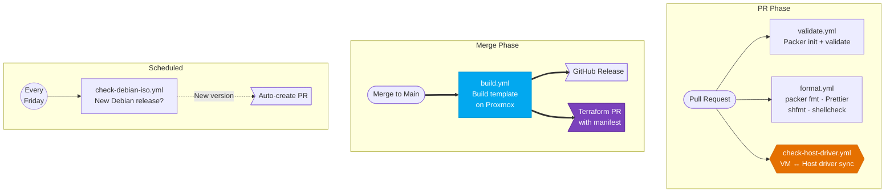
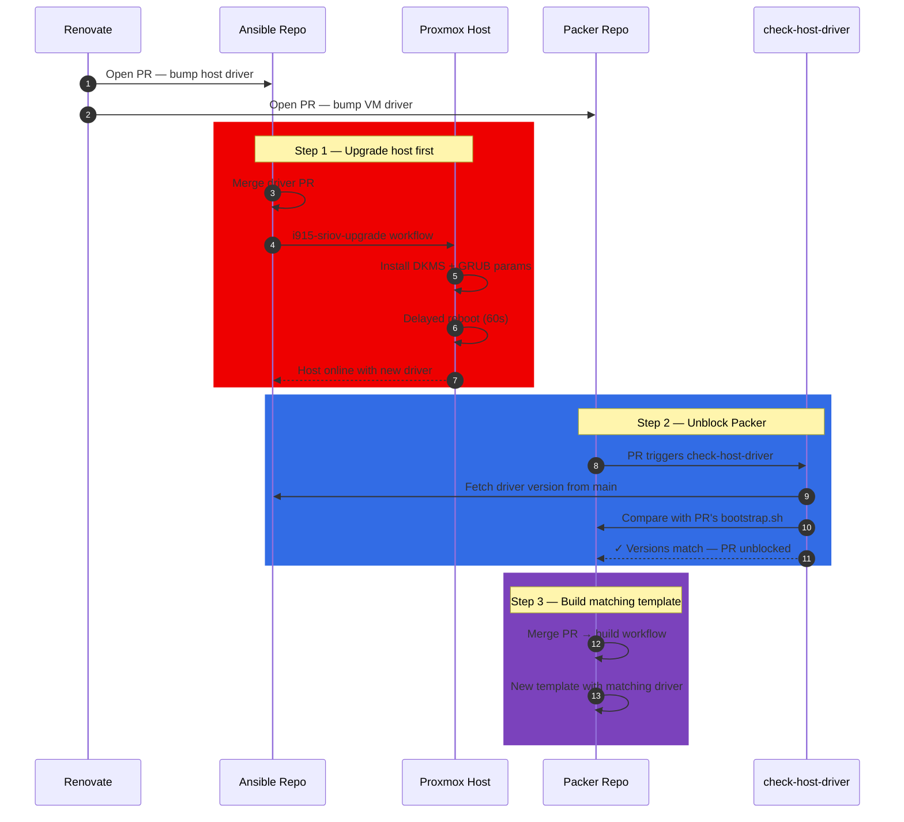

<div align="center">

# 📦 Packer — Golden Image Factory

**Automated, immutable Debian VM template builds for Proxmox VE**

[](https://www.packer.io/)
[](https://www.proxmox.com/)
[](https://www.debian.org/)
[](#)

*The first stage of a fully automated infrastructure pipeline — from bare ISO to production-ready VM template*

</div>

---

## Table of Contents

- [Overview](#overview)
- [Build Pipeline](#build-pipeline)
- [What Gets Built](#what-gets-built)
- [Configuration](#configuration)
- [CI/CD Automation](#cicd-automation)
- [Cross-Repo Integration](#cross-repo-integration)
- [Prerequisites](#prerequisites)
- [Usage](#usage)
- [License \& Contributing](#license--contributing)

---

## Overview

This repository produces **production-ready Debian VM templates** on Proxmox VE. Each template is a sealed, immutable "golden image" that includes:

- **Cloud-init** for zero-touch provisioning when cloned
- **Intel i915 SR-IOV DKMS driver** for GPU virtual function passthrough
- **Modern networking** (systemd-networkd + netplan) replacing legacy ifupdown
- **Hardened GRUB** with GPU and security parameters baked in
- **Clean machine identity** for unique clone provisioning

When a build completes, it automatically generates a manifest that triggers downstream Terraform provisioning — no manual steps required.

---

## Build Pipeline

Every template is built through a deterministic 4-stage pipeline:

```mermaid
flowchart LR
    subgraph preseed["Stage 1 · Preseed"]
        A([Debian ISO]) ==> B[Automated\nInstaller] ==> C[Base OS + SSH\n+ QEMU Agent]
    end

    subgraph bootstrap["Stage 2 · Bootstrap"]
        C ==> D[Package\nUpgrades] ==> E[SR-IOV\nDriver] ==> F[Netplan\nMigration] ==> G[GRUB\nHardening]
    end

    subgraph cloudinit["Stage 3 · Cloud-Init"]
        G ==> H[Datasource\nConfig] ==> I[Default User\nSetup] ==> J[Module\nOrdering]
    end

    subgraph finalize["Stage 4 · Finalize"]
        J ==> K[Remove\nBuild User] ==> L[(Seal as\nTemplate)] ==> M>Manifest JSON]
    end

    classDef input fill:#A81D33,stroke:#8B1728,color:#fff
    classDef store fill:#E57000,stroke:#CC6300,color:#fff
    classDef output fill:#02A8EF,stroke:#0196D4,color:#fff
    class A input
    class L store
    class M output
```



| Stage | Purpose | Key Actions |
|-------|---------|-------------|
| **Preseed** | Unattended Debian install from ISO | Locale, partitioning, base packages, temporary build user |
| **Bootstrap** | Post-install hardening & drivers | SR-IOV DKMS, netplan migration, GRUB params, firmware cleanup |
| **Cloud-Init** | Provisioning framework | Proxmox datasources, default user, module pipeline |
| **Finalize** | Seal & export | Remove build user, convert to template, emit manifest JSON |

---

## What Gets Built

The output is a Proxmox VM template with these properties:

| Property | Value |
|----------|-------|
| **Guest OS** | Debian Trixie (latest stable) |
| **Machine Type** | q35 (UEFI-ready) |
| **SCSI Controller** | virtio-scsi-pci |
| **Disk** | Thin-provisioned on ZFS with TRIM |
| **Network** | Virtio NIC with netplan/systemd-networkd |
| **GPU Support** | Intel i915 SR-IOV DKMS (GuC enabled, `xe` driver blacklisted) |
| **Provisioning** | Cloud-init (NoCloud + ConfigDrive datasources) |
| **Root Login** | Disabled — sudo-capable default user only |

---

## Configuration

Build parameters are organized across HCL variable files:

| File | Purpose |
|------|---------|
| `variables.pkr.hcl` | All variable declarations with defaults |
| `debian.auto.pkrvars.hcl` | ISO version pin (auto-updated by Renovate & CI) |
| `config.pkr.hcl` | Plugin versions and dynamic naming |
| `source.pkr.hcl` | Proxmox API, VM hardware, network config |
| `build.pkr.hcl` | Provisioner chain and manifest post-processor |

Key configurable parameters:

| Parameter | Default | Description |
|-----------|---------|-------------|
| `proxmox_node` | `pve` | Target Proxmox node |
| `vm_id` | `900` | Template VM ID |
| `disk_storage_pool` | `local-zfs` | ZFS pool for template disk |
| `cpu_type` | `host` | CPU passthrough mode |
| `cores` / `memory` | `1` / `1024` | Build-time resources (not runtime) |
| `timezone` | `US/Eastern` | System timezone |
| ISO version | *(auto-managed)* | Pinned in `debian.auto.pkrvars.hcl` |

> **Note:** Proxmox API credentials and runner IP are injected via CI secrets — never committed to the repo.

---

## CI/CD Automation

Five GitHub Actions workflows automate the full lifecycle:



| Workflow | Trigger | Purpose |
|----------|---------|---------|
| **validate** | PR | Runs `packer init` + `packer validate` |
| **format** | PR | Enforces `packer fmt`, Prettier, shfmt, shellcheck |
| **check-host-driver** | PR (bootstrap.sh changes) | Blocks merge if VM driver version > Proxmox host driver |
| **build** | Push to main | Full build → GitHub Release → Terraform manifest PR |
| **check-debian-iso** | Weekly (Friday) | Scrapes debian.org for new ISO releases, auto-creates PR |

### Driver Version Synchronization

A critical safety check ensures the **Proxmox host always has a driver version ≥ the VM template's driver**. When Renovate detects a new driver release, it opens PRs in both this repo and the Ansible repo simultaneously — but they must be merged in the correct order:



If a developer tries to merge the Packer PR first, `check-host-driver` fails with a descriptive comment explaining which Ansible PR must be merged first — preventing VMs from ever being built with a driver version ahead of the hypervisor.

---

## Cross-Repo Integration

This repo is the **entry point** of a 4-stage infrastructure pipeline:


1. **Packer** builds a template and generates `packer-manifest.json`
2. The build workflow **creates a PR in the Terraform repo** with the updated manifest
3. Terraform clones the new template into cluster VMs
4. Terraform triggers Ansible via `repository_dispatch`
5. Ansible provisions K3s and bootstraps ArgoCD
6. ArgoCD reconciles the Apps repo onto the cluster

---

## Prerequisites

- **Proxmox VE** with API token access (VM.Allocate, VM.Clone, VM.Config.\*, Datastore.\*, Sys.Modify)
- **Storage pools**: ISO storage (`local`) + ZFS disk pool (`local-zfs`)
- **Network**: HTTP port 8000 accessible from Proxmox to the build runner (preseed serving)
- **Packer** ≥ 1.10 with the `hashicorp/proxmox` plugin

---

## Usage

```bash
# Initialize plugins
packer init -upgrade .

# Validate configuration
packer validate .

# Build the template (requires Proxmox credentials)
packer build -force .
```

> In practice, builds are triggered automatically via CI on merge to `main`.

---

## License & Contributing

This is a personal homelab project. Feel free to use it as inspiration for your own infrastructure. If you spot an issue or have a suggestion, [open an issue](../../issues) — contributions and feedback are welcome.
