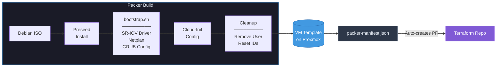
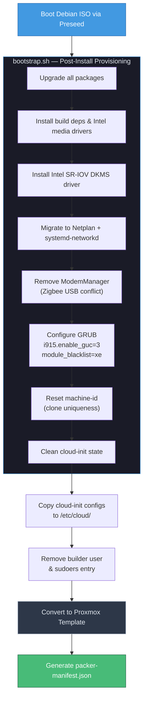
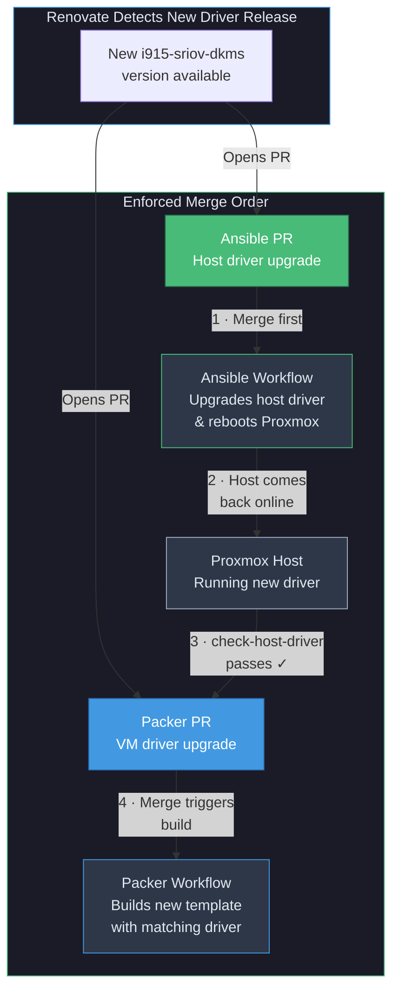
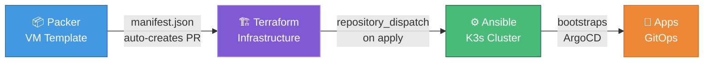

# Homelab Packer

[](https://github.com/Starktastic-Homelab/packer/actions/workflows/build.yml)
[](https://github.com/Starktastic-Homelab/packer/actions/workflows/validate.yml)
[](https://github.com/Starktastic-Homelab/packer/actions/workflows/check-debian-iso.yml)


Production-ready Debian 13 (Trixie) VM template builder for Proxmox VE — cloud-init provisioned, Intel SR-IOV GPU passthrough pre-configured, and fully automated through CI/CD.

## Overview

This is the first stage of the [Starktastic Homelab](https://github.com/Starktastic-Homelab) pipeline. It builds golden VM templates on Proxmox VE that serve as the immutable foundation for every Kubernetes node in the cluster. Each template ships with Intel SR-IOV DKMS drivers for hardware GPU passthrough, a modern systemd-networkd/Netplan network stack, and a clean cloud-init configuration — ready to be cloned and provisioned by [Terraform](https://github.com/Starktastic-Homelab/terraform) in the next pipeline stage.



## Features

- **Debian 13 (Trixie)** — Latest stable Debian with a modern kernel
- **Cloud-Init Ready** — Full cloud-init integration with Proxmox NoCloud/ConfigDrive datasources
- **Intel SR-IOV GPU** — Pre-installed i915 DKMS driver for virtual function GPU passthrough
- **Netplan + systemd-networkd** — Modern network stack replacing legacy ifupdown
- **Security Hardened** — Builder user purged, machine-id reset, no root login, minimal packages
- **Renovate Managed** — Debian ISO version and SR-IOV driver version auto-updated via PRs
- **Manifest Output** — Produces `packer-manifest.json` consumed downstream by Terraform

## Repository Structure

```
packer/
├── build.pkr.hcl              # Build pipeline — provisioners & post-processor
├── config.pkr.hcl             # Plugin requirements & template name generation
├── source.pkr.hcl             # Proxmox ISO source — VM hardware & boot config
├── variables.pkr.hcl          # All variable definitions with defaults & validation
├── debian.auto.pkrvars.hcl    # Current Debian ISO version (Renovate-managed)
├── cloud-init/
│   ├── cloud.cfg              # Cloud-init module ordering & default user config
│   └── cloud.cfg.d/
│       └── 99-pve.cfg         # Proxmox datasource priority (NoCloud, ConfigDrive)
├── http/
│   └── preseed.cfg.tmpl       # Templated Debian preseed for unattended install
└── scripts/
    ├── bootstrap.sh           # Post-install provisioning (driver, network, GRUB)
    └── delete_builder_user.sh # Removes temporary build user & sudoers entry
```

## Build Process

The build executes four provisioners in sequence, producing a clean VM template from a stock Debian ISO:



### What Gets Built

The resulting template is a minimal, hardened Debian image:

| Layer | Details |
|-------|---------|
| **OS** | Debian 13 (Trixie) — single root partition, UEFI + GRUB |
| **Cloud-Init** | Proxmox-compatible datasources (NoCloud, ConfigDrive) |
| **Network** | Netplan → systemd-networkd + systemd-resolved |
| **GPU** | Intel i915 SR-IOV DKMS driver, GuC firmware enabled |
| **GRUB** | `i915.enable_guc=3 module_blacklist=xe`, hidden timeout |
| **Packages** | qemu-guest-agent, openssh-server, nfs-common, vainfo |
| **Users** | None — builder user removed, root disabled |
| **Identity** | `/etc/machine-id` truncated for unique clones |

## Output

The build produces a `packer-manifest.json` with metadata consumed by [Terraform](https://github.com/Starktastic-Homelab/terraform):

```json
{
  "builds": [{
    "custom_data": {
      "vm_name": "packer-debian-13.4.0-20260321165557",
      "git_tag": "v13.4.0.20260321165557",
      "i915_sriov_version": "2026.03.05"
    }
  }]
}
```

When a build completes on `main`, the CI workflow **automatically creates a PR** in the Terraform repo with the updated manifest — advancing the pipeline without manual intervention.

## Configuration

### Variables

| Variable | Description | Default |
|----------|-------------|---------|
| `proxmox_api_url` | Proxmox API endpoint | **Required** |
| `proxmox_api_token_id` | API token ID (`user@pam!token`) | **Required** |
| `proxmox_api_token_secret` | API token secret | **Required** |
| `proxmox_node` | Target Proxmox node | `pve` |
| `vm_id` | Template VM ID in Proxmox | `900` |
| `iso_name` | Debian ISO filename (Renovate-managed) | `debian-13.4.0-amd64-netinst.iso` |
| `iso_storage_pool` | Proxmox ISO storage pool | `local` |
| `disk_storage_pool` | Proxmox VM disk storage pool | `local-zfs` |
| `network_adapter_bridge` | Network bridge for build VM | `vmbr0` |
| `cpu_type` | CPU type passed to QEMU | `host` |
| `cores` | CPU cores for build VM | `1` |
| `memory` | RAM (MB) for build VM | `1024` |
| `runner_host_ip` | IP of machine serving preseed via HTTP | `127.0.0.1` |
| `builder_creds` | Temporary build user credentials | `packer` / `packer` |
| `timezone` | System timezone for preseed | `US/Eastern` |
| `apt_mirror` | APT mirror configuration object | Debian CDN |

### Environment Variables (Local Builds)

```bash
export PKR_VAR_proxmox_api_url="https://pve.example.com:8006/api2/json"
export PKR_VAR_proxmox_api_token_id="packer@pve!packer-token"
export PKR_VAR_proxmox_api_token_secret="xxxxxxxx-xxxx-xxxx-xxxx-xxxxxxxxxxxx"
```

## Prerequisites

- **Proxmox VE** with API token permissions: `VM.Allocate`, `VM.Clone`, `VM.Config.*`, `VM.Audit`, `VM.PowerMgmt`, `Datastore.AllocateSpace`, `Datastore.Audit`, `Sys.Modify`
- **Storage pools** configured: ISO pool (default `local`) and disk pool (default `local-zfs`)
- **Network bridge** `vmbr0` (or configured alternative) accessible from build machine
- **Packer** >= 1.10 (for local builds)
- **HTTP port 8000** reachable from Proxmox to the build machine (preseed serving)

## Usage

```bash
# Initialize plugins
packer init .

# Validate configuration
packer validate .

# Build template
packer build .
```

## CI/CD

| Workflow | Trigger | Description |
|----------|---------|-------------|
| **build.yml** | Push to `main` | Builds template → creates GitHub Release → opens PR in Terraform repo with updated manifest |
| **validate.yml** | Pull requests | Validates Packer HCL configuration |
| **format.yml** | Pull requests | Checks HCL formatting consistency |
| **check-debian-iso.yml** | Weekly schedule | Checks for new Debian point releases → opens version-bump PR |
| **check-host-driver.yml** | PRs touching `bootstrap.sh` | **Blocks merge** until Proxmox host has matching SR-IOV driver version |

### Required Secrets

| Secret | Purpose |
|--------|---------|
| `PROXMOX_API_TOKEN_ID` | Proxmox API authentication |
| `PROXMOX_API_TOKEN_SECRET` | Proxmox API authentication |
| `ORG_DISPATCH_TOKEN` | Cross-repo PAT for creating PRs in the Terraform repo |

## Intel SR-IOV Driver Coordination

The i915 SR-IOV DKMS driver must be installed on **both** the Proxmox host (to create virtual functions) and the VM template (to consume them). Renovate detects new releases and opens PRs in both repos simultaneously, but they must be **merged in the correct order**.



The `check-host-driver.yml` workflow acts as a **merge gate**: it extracts the driver version from the PR, compares it against Ansible's `main` branch, and **fails with a descriptive comment** if the Proxmox host hasn't been updated yet — ensuring VMs are never built with a driver version ahead of the hypervisor.

## Pipeline Position

This repository is the **entry point** of the fully automated homelab pipeline:



## Troubleshooting

| Issue | Solution |
|-------|----------|
| SSH timeout during build | Verify Proxmox firewall allows SSH to the build VM |
| SR-IOV driver install fails | Check kernel headers are available (`linux-headers-amd64`) and inspect `/var/lib/dkms/` logs |
| Cloud-init doesn't run on clone | Ensure machine-id was truncated and `cloud-init clean` was executed |
| Preseed HTTP timeout | Verify `runner_host_ip` is routable from Proxmox and port 8000 is open |
| `check-host-driver` blocks PR | Merge the Ansible driver PR first, wait for host reboot |

## Related Repositories

| Repository | Role in Pipeline |
|------------|-----------------|
| [terraform](https://github.com/Starktastic-Homelab/terraform) | Consumes the manifest to provision K3s VMs |
| [ansible](https://github.com/Starktastic-Homelab/ansible) | Installs K3s and bootstraps the cluster |
| [apps](https://github.com/Starktastic-Homelab/apps) | GitOps application definitions deployed by ArgoCD |

## License

MIT
