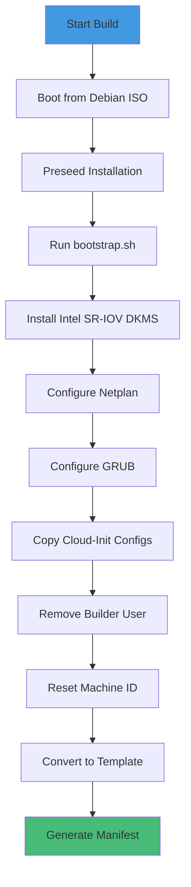
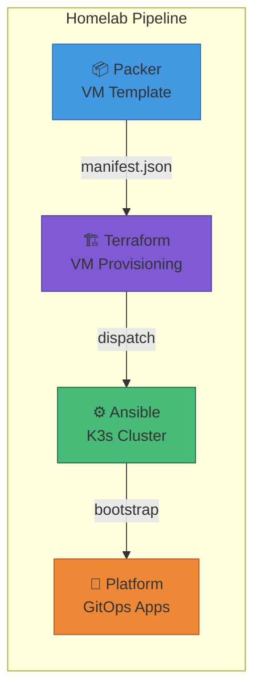
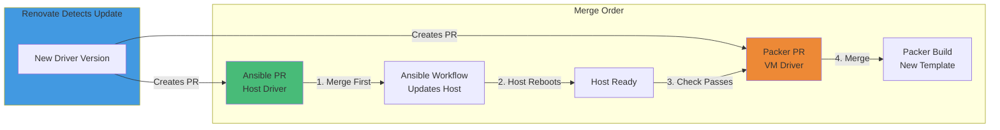

# Homelab Packer

[](https://github.com/starktastic/homelab-packer/actions/workflows/build.yml)
[](https://github.com/starktastic/homelab-packer/actions/workflows/validate.yml)
[](https://github.com/starktastic/homelab-packer/actions/workflows/check-debian-iso.yml)


Automated Debian 13 (Trixie) VM template builder for Proxmox VE with cloud-init support and Intel SR-IOV GPU passthrough pre-configured.

## Overview

This repository builds production-ready VM templates that serve as the foundation for the homelab Kubernetes cluster. Templates include pre-installed Intel SR-IOV DKMS drivers for GPU passthrough and are configured for cloud-init based provisioning.

```mermaid
flowchart LR
    subgraph Packer["Packer Build"]
        ISO[Debian ISO] --> Preseed[Preseed Install]
        Preseed --> Bootstrap[Bootstrap Script]
        Bootstrap --> CloudInit[Cloud-Init Config]
        CloudInit --> Template[VM Template]
    end
    
    Template --> Manifest[packer-manifest.json]
    Manifest -->|Triggers PR| Terraform[homelab-terraform]
    
    style Packer fill:#2d3748,stroke:#4299e1
    style Terraform fill:#805ad5,stroke:#d6bcfa
```



## Features

- 🖥️ **Debian 13 (Trixie)** - Latest stable Debian with modern kernel
- ☁️ **Cloud-Init Ready** - Full cloud-init integration for VM provisioning
- 🎮 **Intel SR-IOV GPU** - Pre-installed DKMS driver for GPU passthrough
- 🌐 **Netplan + systemd-networkd** - Modern network configuration
- 🔒 **Security Hardened** - Builder user removed, machine-id reset
- 🔄 **Renovate Managed** - Automated dependency updates

## Repository Structure

```
homelab-packer/
├── build.pkr.hcl           # Build definition with provisioners
├── config.pkr.hcl          # Plugin requirements and locals
├── source.pkr.hcl          # Proxmox ISO source configuration
├── variables.pkr.hcl       # Variable definitions with defaults
├── debian.auto.pkrvars.hcl # Current Debian ISO version
├── cloud-init/
│   ├── cloud.cfg           # Cloud-init main configuration
│   └── cloud.cfg.d/
│       └── 99-pve.cfg      # Proxmox datasource config
├── http/
│   └── preseed.cfg.tmpl    # Debian preseed template
└── scripts/
    ├── bootstrap.sh        # VM provisioning script
    └── delete_builder_user.sh
```

## Prerequisites

### Proxmox VE Setup

1. **API Token**: Create a Proxmox API token with the following permissions:
   - `VM.Allocate`, `VM.Clone`, `VM.Config.*`, `VM.Audit`, `VM.PowerMgmt`
   - `Datastore.AllocateSpace`, `Datastore.Audit`
   - `Sys.Modify` (for ISO operations)

2. **Storage Pools**: Ensure you have:
   - An ISO storage pool (default: `local`)
   - A disk storage pool (default: `local-zfs`)

3. **Network**: A bridge interface configured (default: `vmbr0`)

### Local Development

- [Packer](https://www.packer.io/downloads) >= 1.10
- Network access to your Proxmox host
- HTTP port 8000 accessible from Proxmox to the build machine

## Configuration

### Variables

| Variable | Description | Default |
|----------|-------------|---------|
| `proxmox_api_url` | Proxmox API URL | **Required** |
| `proxmox_api_token_id` | API token ID (e.g., `user@pam!token`) | **Required** |
| `proxmox_api_token_secret` | API token secret | **Required** |
| `proxmox_node` | Proxmox node name | `pve` |
| `vm_id` | Template VM ID | `900` |
| `iso_name` | Debian ISO filename | From `debian.auto.pkrvars.hcl` |
| `iso_storage_pool` | Proxmox storage for ISOs | `local` |
| `disk_storage_pool` | Proxmox storage for VM disks | `local-zfs` |
| `network_adapter_bridge` | Network bridge | `vmbr0` |
| `i915_sriov_dkms_version` | Intel SR-IOV driver version | Renovate managed |

### Environment Variables

```bash
export PKR_VAR_proxmox_api_url="https://proxmox.example.com:8006/api2/json"
export PKR_VAR_proxmox_node="pve"
export PKR_VAR_proxmox_api_token_id="packer@pve!packer-token"
export PKR_VAR_proxmox_api_token_secret="xxxxxxxx-xxxx-xxxx-xxxx-xxxxxxxxxxxx"
```

## Usage

### Local Build

```bash
# Initialize plugins
packer init .

# Validate configuration
packer validate .

# Format HCL files
packer fmt .

# Build template
packer build -var-file=my.pkrvars.hcl .
```

### CI/CD Workflows

| Workflow | Trigger | Description |
|----------|---------|-------------|
| `build.yml` | Push to main | Builds VM template, creates release, triggers Terraform PR |
| `validate.yml` | Pull requests | Validates Packer configuration |
| `format.yml` | Pull requests | Checks HCL formatting |
| `check-debian-iso.yml` | Weekly schedule | Auto-updates Debian ISO version |
| `check-host-driver.yml` | PRs modifying `bootstrap.sh` | Ensures Proxmox host SR-IOV driver is updated first |

### Required Secrets

| Secret | Description |
|--------|-------------|
| `PROXMOX_API_TOKEN_ID` | Proxmox API token ID |
| `PROXMOX_API_TOKEN_SECRET` | Proxmox API token secret |
| `ORG_DISPATCH_TOKEN` | Token for cross-repo dispatch (Terraform updates) |

## Build Process



### What Gets Built

The resulting VM template includes:

- **Debian 13 (Trixie)** minimal installation
- **Cloud-init** configured with Proxmox datasource
- **Netplan** with systemd-networkd/resolved
- **Intel SR-IOV DKMS driver** for GPU passthrough
- **GRUB** configured with `i915.enable_guc=3` and `module_blacklist=xe`
- **Clean machine ID** for proper clone uniqueness
- **No default users** (builder user is removed post-build)

## Output

The build produces a `packer-manifest.json` containing:

```json
{
  "builds": [{
    "custom_data": {
      "vm_name": "debian-cloud-v1.2.3",
      "git_tag": "v1.2.3",
      "i915_sriov_dkms_version": "1.0.0"
    }
  }]
}
```

This manifest is consumed by [homelab-terraform](https://github.com/starktastic/homelab-terraform) to provision VMs using the latest template.

## Pipeline Integration



## Troubleshooting

### Common Issues

| Issue | Solution |
|-------|----------|
| SSH timeout during build | Check Proxmox firewall allows SSH to VM |
| Intel SR-IOV driver fails | Verify kernel headers available, check `/var/lib/dkms/` logs |
| Cloud-init not working | Ensure machine-id was reset, verify datasource config |
| Preseed HTTP timeout | Verify `runner_host_ip` is reachable from Proxmox |

## Intel SR-IOV Driver Coordination

The Intel SR-IOV DKMS driver must be installed on both the **Proxmox host** (for VF creation) and the **VM template** (for VF passthrough). The versions must be kept in sync.



### Merge Order Enforcement

The `check-host-driver.yml` workflow runs as a required PR check on any changes to `scripts/bootstrap.sh`. It:

1. **Extracts** the proposed driver version from the PR
2. **Fetches** the current driver version from Ansible's `main` branch
3. **Compares** the versions
4. **Fails** with a helpful comment if the Proxmox host hasn't been updated yet

This ensures VMs are never built with a driver version that's ahead of the host.

## Related Repositories

| Repository | Description |
|------------|-------------|
| [homelab-terraform](https://github.com/starktastic/homelab-terraform) | VM provisioning with Terraform |
| [homelab-ansible](https://github.com/starktastic/homelab-ansible) | K3s cluster configuration |
| [homelab-platform](https://github.com/starktastic/homelab-platform) | GitOps application definitions |

## License

MIT
